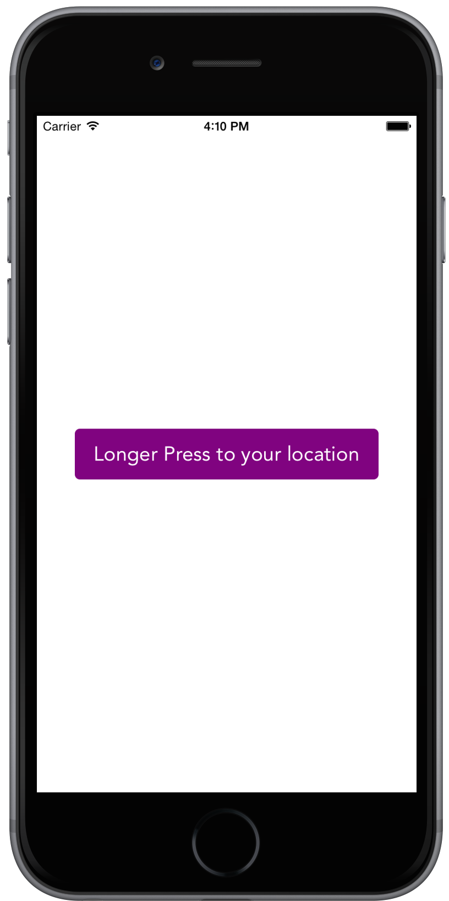

# SwiftToast
Simple toast messages for Swift iOS / iPad Applications

Toast Messages originated from Android. 
We found it easy & non intrusive for users to take followup actions. 

- Programmable duration for Toast 
- Programmable color for Toast
- Easy to integrate 

  

SwiftToast is part of Swift Experiments @ MobileFirst. 

